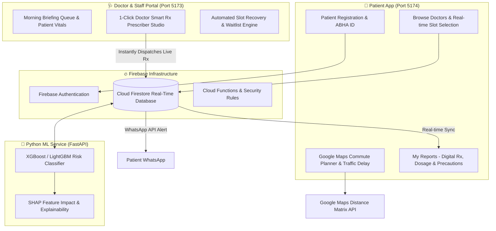

# 🏥 Apollo OPD Intelligence & Smart Care Ecosystem
> **The Ultimate AI-Powered OPD Queue Management & Digital Prescription Platform**  
> *Built for Patients, Doctors, and Hospital Operations*

---

## 📌 Executive Summary (The 30-Second Elevator Pitch)

In traditional Indian hospital Outpatient Departments (OPD), **over 30% of booked consultations result in no-shows or severe delay bottlenecks**, causing massive revenue leaks for hospitals and endless waiting room frustration for patients.

**Apollo OPD** solves this with an end-to-end dual-portal AI ecosystem:
1. **For Patients**: Smart doctor booking with live Google Maps commute traffic predictions, ABHA Health Locker integration, and a **1-Click Digital Prescription & Care Plan** showing exact medicine timings (Morning/Night), dietary precautions (things to avoid), and follow-up dates.
2. **For Doctors & Hospital Staff**: An **AI-driven OPD Operations Center** with 1-Click Smart Prescriber Studio, machine-learning no-show risk forecasting (SHAP explainable), automated slot recovery, and instant WhatsApp notifications.

---

## ⚡ Problem vs. Solution

| Traditional Hospital OPD | 🚀 Apollo OPD Solution |
| :--- | :--- |
| **High No-Show Rates**: Patients miss appointments without notice, leaving doctor slots empty. | **AI No-Show Risk Engine**: ML model predicts no-show probability and triggers persona-tailored WhatsApp nudges. |
| **Traffic & Commute Delays**: Patients arrive late due to unexpected city traffic congestion. | **Google Maps Live Commute Planner**: Calculates road distance, peak traffic margins, and departure windows. |
| **Paper Prescriptions**: Hand-written notes are easily lost, illegible, or lack clear dosage timing instructions. | **1-Click Digital Rx & Care Plan**: Doctor ticks boxes to generate instant, beautifully formatted Rx with PDF print & WhatsApp dispatch. |
| **Wasted Slot Inventory**: Cancelled slots remain empty while other patients wait weeks for appointments. | **Automated Slot Recovery**: Instantly reallocates cancelled slots to waitlisted patients via automated alerts. |

---

## 🌐 System Architecture & Ecosystem

---

## 💎 Core Feature Breakdown

### 1. 📱 Patient Portal (`APOLLO-PATIENT`)
* **ABHA Health Locker Integration**: Verified ABHA ID (`91-8273-9182-10`) with synced vital signs (Blood Pressure, Heart Rate, SpO2).
* **Smart Doctor Search & Filter**: Search across 6+ specialties (Cardiology, Orthopedics, General Medicine, Dermatology, etc.) with real-time slot availability.
* **Google Maps Commute & Traffic Planner**: Calculates real-time road distance (km), estimated transit duration, peak-hour traffic margins, and recommended departure times.
* **"My Reports" Digital Prescription Hub**:
  * **Doctor Clinical Diagnosis**: ICD-10 coded diagnosis (e.g., *Mild Essential Hypertension*).
  * **Daily Dosage Schedule**: Visually displays medicine timing (Morning after breakfast ☀️, Night after dinner 🌙, Sunday Morning 🥛).
  * **Health Advice & Things to Avoid**: Bulleted list of dietary & lifestyle precautions (e.g., *Limit salt < 5g/day, Avoid caffeine near meds, Drink 3.5L water*).
  * **Follow-up Date & PDF Export**: Prominent follow-up badge (e.g., *5th August 2026*) and 1-click **Print / Download PDF** option.

---

### 2. 🩺 Doctor & Staff Intelligence Portal (`DEMO-DAY`)
* **1-Click Doctor Smart Rx Prescriber Studio**:
  * Eliminates typing! Doctors simply **tick checkboxes** for diagnoses, pre-configured medicines, dosage timings (Morning/Afternoon/Night), and health precautions.
  * Click **"Generate & Dispatch"**: Takes 1 second to create a formatted Rx and push it live to the patient's portal and WhatsApp.
* **AI No-Show Risk Predictor**:
  * Evaluates patient historical attendance, commute distance, booking lead time, age, and weather forecast to assign a risk score (*High / Medium / Low*).
* **SHAP Explainability Insights**:
  * Shows staff *why* a patient is flagged (e.g., `Distance from hospital +40% · Booked 14 days ago +25%`).
* **Automated Slot Recovery Engine**:
  * When an appointment is cancelled or flagged as high-risk no-show, the system automatically offers the freed slot to patients on the waitlist.

---

## 🛠️ Complete Technology Stack

| Component | Technology | Purpose |
| :--- | :--- | :--- |
| **Frontend Framework** | React 19, Vite 8 | Ultra-fast Single Page Application rendering |
| **Styling & Motion** | TailwindCSS v4, Framer Motion, Lucide Icons | Premium glassmorphism UI, smooth animations, accessible icons |
| **State & Data Sync** | Firebase Cloud Firestore | Real-time database listeners (`onSnapshot`) and atomic transactions |
| **Authentication** | Firebase Auth & Local Session Storage | Role-based authentication (Patient vs. Hospital Staff) |
| **AI / Machine Learning** | Python, FastAPI, XGBoost, SHAP | No-show risk scoring & explainable AI breakdown |
| **Maps & Traffic API** | Google Maps Distance Matrix & Geocoding API | Real-time road distance, drive duration, and traffic congestion scoring |
| **Document Generation** | Browser Print API & Custom CSS Media Styles | High-resolution PDF prescription exporting |

---

## 🗣️ Hackathon Judge Q&A Guide (How to Answer Questions)

### ❓ Non-Technical Questions

#### Q1: "What is the core business value or ROI for hospitals?"
> **Answer**: "Hospitals lose thousands of rupees every day when doctor slots go unfilled due to no-shows and late arrivals. Apollo OPD reduces no-shows through persona-tailored WhatsApp reminders, recovers empty slots automatically via the waitlist engine, and saves doctors 2-3 minutes per patient with 1-click digital prescriptions."

#### Q2: "How does this help non-tech-savvy elderly patients?"
> **Answer**: "We built persona-tailored notification channels. For elderly patients, reminders are automatically sent to their designated family caretaker via WhatsApp and automated calls, while the prescription UI uses large text, color-coded dosage timing badges, and PDF printability."

---

### ❓ Technical Questions

#### Q3: "How do you ensure data synchronization between Doctor and Patient portals?"
> **Answer**: "We leverage Firebase Cloud Firestore real-time listeners (`onSnapshot`) and atomic transactions (`runTransaction`). When a doctor ticks a prescription box on Port 5173, Firestore writes the document atomically, triggering an instant real-time UI update on the patient's 'My Reports' page (Port 5174) without needing a page refresh."

#### Q4: "How does the ML model handle explainability (SHAP)?"
> **Answer**: "Instead of using a 'black box' model, our Python FastAPI service calculates SHAP (SHapley Additive exPlanations) values for every prediction. It identifies the exact top features contributing to a no-show risk—such as high commute distance or long booking lead time—giving clinic managers actionable insight."

---

## 🎬 3-Minute Live Demo Walkthrough Script

1. **Step 1: Patient Booking (Port 5174)**
   * Open `http://localhost:5174/doctors`
   * Select a doctor (e.g. *Dr. Arvind Mehta - Cardiology*), choose a time slot, and click **Review & Confirm**.
   * Highlight the **Google Maps Commute Planner**: Show the live road distance, peak traffic delay, and recommended departure window.
   * Click **Confirm Booking**.

2. **Step 2: Doctor Dashboard & 1-Click Rx (Port 5173 & 5174)**
   * Switch to `http://localhost:5173/` (Doctor Portal).
   * Show the live appointment appearing in the queue with patient details.
   * Go to `http://localhost:5174/reports` (My Reports page).
   * Click **`🩺 Doctor Demo: Create Rx (1-Click)`**.
   * Tick checkboxes for Diagnosis (*Hypertension*), Medicines (*Telmisartan Morning, Metformin Night*), and Precautions (*Low Salt, 3.5L Water*).
   * Click **AI Auto-Generate & Dispatch Rx**.
   * **Result**: Show the instant live prescription generation with dosage schedule, precautions, and PDF download button!

---

*Document compiled for Hackathon Presentation & Technical Evaluation.*
